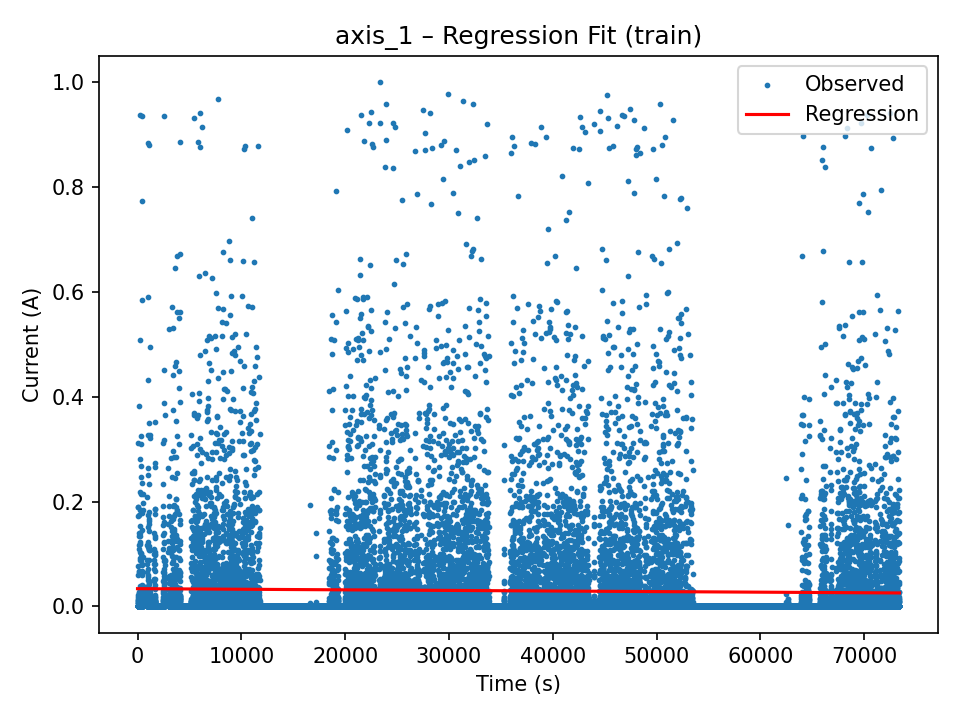
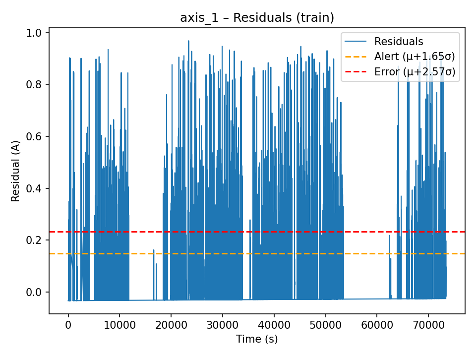
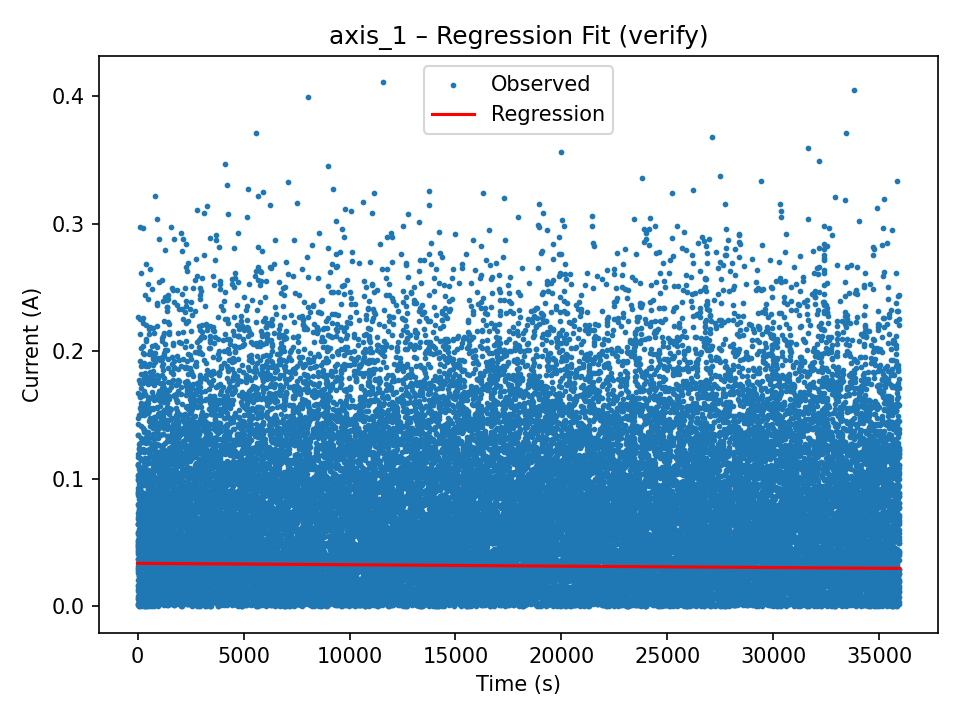
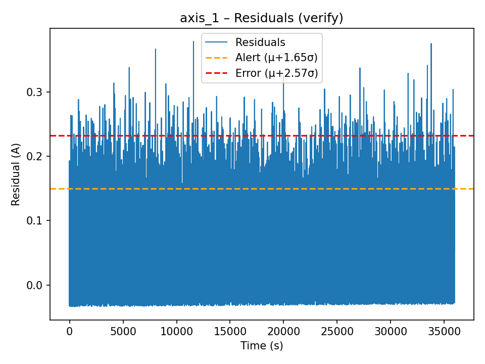

# Predictive Maintenance with Robot Current Data

## 📌 Project Summary

This project implements a **predictive maintenance pipeline** for industrial robots based on motor current readings from individual axes.  
The system ingests **historical current data** (from Neon/Postgres), builds **regression models**, analyzes **residuals**, and establishes **dynamic thresholds** for detecting **alerts** and **errors**.  
Synthetic test datasets are also generated for controlled verification of anomaly detection logic.

Key features:

- Database integration with **Neon.tech (Postgres)**
- **Univariate regression models** for each axis
- **Residual-based anomaly detection**
- **Synthetic test data generation** (normalized/standardized)
- Streaming simulation using CSVs
- **Alert/Error detection rules** with automatic logging
- Visualization of regression fits, residuals, and anomalies

---

## ⚙️ Setup Instructions

### 1. Clone Repository

```bash
git clone https://github.com/Femi-lawal/DataStreamVisualization_Workshop.git
cd DataStreamVisualization_Workshop
```

### 2. Create Virtual Environment

```bash
python3 -m venv venv
source venv/bin/activate
```

### 3. Install Dependencies

```bash
pip install -r requirements.txt
```

### 4. Database Setup

- Ensure you have credentials for **Neon.tech Postgres** or equivalent.
- Example DB configuration (`DB_CONFIG` in code):

```python
DB_CONFIG = {
    "host": "YOUR-HOST",
    "database": "YOUR-DB",
    "user": "YOUR-USER",
    "password": "YOUR-PASSWORD",
    "port": "5432",
    "sslmode": "require",
}
```

### 5. Run End-to-End Pipeline

```bash
Run the entire pipeline.ipynb notebook
```

---

## 📊 Regression & Alert Rules

### Regression Models

For each axis (#1–#8):

- A **linear regression** is fit on time vs. current.
- Residuals = observed − predicted.

### Threshold Discovery

Residuals are assumed to follow a distribution around **μ ± σ**:

- **Alert threshold (MinC):** μ + 1.65σ
- **Error threshold (MaxC):** μ + 2.57σ
- **T (sustain time):** Based on 95th percentile run length of exceedances.

### Detection Rules

- **ALERT**: Residual ≥ MinC for ≥ T seconds
- **ERROR**: Residual ≥ MaxC for ≥ T seconds

Events are logged to `events.csv`.

---

## 📸 Results & Plots

Below are sample outputs (plots saved in `pm_outputs_local/`):

### 1. Regression Fit (Training Data)



### 2. Residuals with Thresholds



### 3. Verification on Synthetic Data



### 4. Residuals (Verification)



---

## 📂 Repository Structure

```
├── data/                             # input CSVs (historical + synthetic)
├── pm_outputs_local/                 # generated plots & results
│   ├── axis_1_regression_train.png
│   ├── axis_1_residuals_train.png
│   ├── thresholds.csv
│   ├── events.csv                    # Logged events
├── pipeline.ipynb                    # end-to-end driver
├── requirements.txt                  # dependencies
├── README.md                         # this file
```
